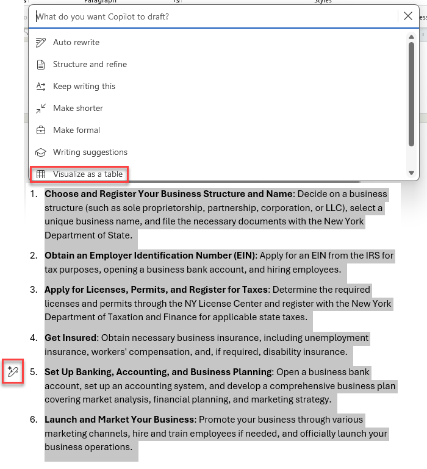
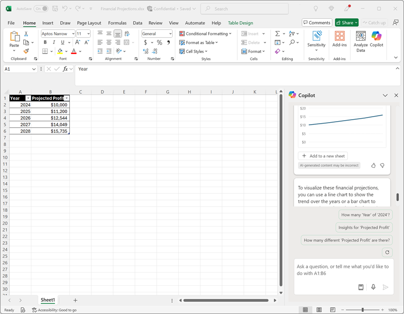

---
lab:
  title: Explora Microsoft 365 Copilot
---
# Explora Microsoft 365 Copilot

¡Te damos la bienvenida al emocionante mundo de Microsoft 365 Copilot!

En este ejercicio, aprovecharás el poder de Copilot para explorar una nueva idea empresarial: crear una empresa de limpieza para empresas.

Imagina esto: estás a punto de empezar un servicio de limpieza de primera categoría que revolucionará los espacios de oficina de todas partes. Con Microsoft Copilot de tu lado, investigarás las tendencias del mercado y desarrollarás un sólido plan de negocio. Pero eso no es todo. También crearás documentos atractivos, presentaciones entretenidas y correos electrónicos convincentes para ayudar a mostrar tu idea y atraer a los inversores.

Prepárate para dar rienda suelta a tu creatividad y agudeza empresarial a medida que te adentras en este atractivo e interactivo laboratorio. Al final de este ejercicio, dispondrás de un completo conjunto de materiales que te encaminarán hacia el éxito empresarial. Empecemos y hagamos realidad tu empresa de limpieza para empresas.

Este ejercicio debería tardar en completarse **40** minutos aproximadamente.

> **Nota**: Este ejercicio requiere una licencia de **Microsoft 365 Copilot**.

## Uso de Copilot para explorar un documento e investigar una idea

Para iniciar la exploración de la inteligencia artificial generativa, vamos a usar Copilot para Word para examinar un documento existente y extraer información de ella.

1. En un buscador web, abre el documento [Business Idea.docx](https://github.com/MicrosoftLearning/mslearn-copilot/raw/main/Allfiles/Business%20Idea.docx) en `https://github.com/MicrosoftLearning/mslearn-copilot/raw/main/Allfiles/Business%20Idea.docx`. 
1. Descarga el archivo en tu carpeta **Descargas**. Después, cierra el navegador.
1. **Mover** o **Copiar y pegar** el documento que acaba de descargar en la carpeta de **OneDrive**.
1. Desde la carpeta de **OneDrive**, abra **Business Idea.docx** en Microsoft Word (cerrando los mensajes de bienvenida o las notificaciones de nuevas características) y revise el documento, que describe algunas ideas de alto nivel para una empresa de limpieza en la ciudad de Nueva York. Si se le solicita, seleccione **Habilitar edición** en la parte superior.

    > **Sugerencia**: puedes cerrar el panel **Navegación** si está abierto para ver más partes del documento.

1. Busque y seleccione el icono de **Copilot** en la barra de herramientas de Word para abrir el panel Copilot, como se muestra aquí (el tema visual puede variar):

    

1. En el panel Copilot, escriba después del símbolo del sistema en el área de texto de la parte inferior:

    ```prompt
    Summarize this document into 5 key points, and suggest next steps.
    ```

1. Revise la respuesta de Copilot, que debe resumir los puntos principales del documento, como se muestra aquí:

    

    > La respuesta específica que reciba puede variar debido a la naturaleza de la inteligencia artificial generativa.

    Esperamos que Copilot haya proporcionado algunas instrucciones útiles. Sin embargo, si tienes preguntas adicionales, puedes solicitar información más específica.

1. Vuelva al panel Copilot para formular a Copilot la siguiente pregunta:

    ```prompt
    How do I setup a new business in New York? Answer with a numbered list.
    ```

1. Revise la respuesta y realice un seguimiento de las preguntas adicionales según sea necesario. Cuando esté satisfecho con la respuesta, use el icono **Copiar** (&#128461;) en la respuesta para copiarlo en el Portapapeles. Pégalo en el documento de Word después del texto existente. Después, selecciona el texto que proporciona una lista de cosas que hay que hacer al crear una empresa en Nueva York y usa el icono Copilot (en la parte inferior del texto seleccionado) para visualizar el texto como una tabla.

    

1. Revisa la tabla y pide a Copilot que agregue más información, como una columna con referencias para obtener más detalles.  La respuesta debe tener un aspecto similar al siguiente (es posible que tenga que usar el botón **Regenerar**):

    

    > **Importante**: La respuesta generada por IA se basa en la información pública en la Web. Aunque puede ser útil ayudarle a comprender los pasos necesarios para configurar un negocio, no se garantiza que sea 100 % preciso y no reemplace la necesidad de asesoramiento profesional.

1. Cuando esté satisfecho con la tabla que ha generado Copilot, seleccione la opción para **Mantenerla**.

## Uso de Copilot para crear contenido para un plan empresarial

Ahora que ha realizado algunas investigaciones iniciales, vamos a que Copilot le ayude a desarrollar un plan de negocio para su empresa de limpieza.

1. Con el documento de **Business Idea.docx** abierto, en el panel Copilot, escriba el siguiente mensaje:

    ```prompt
    Can you suggest a name for my cleaning business?
    ```

1. Revisa las sugerencias y selecciona un nombre para tu empresa de limpieza (o continúa solicitando más sugerencias hasta encontrar un nombre que te guste).
1. Crea un nuevo documento en blanco. Después, en el nuevo documento, selecciona el icono de Copilot en el margen para redactar contenido nuevo. Escriba el siguiente mensaje y reemplace **Contoso Cleaning** por el nombre de la empresa de su elección:

    ```prompt
    Write a business plan for "Contoso Cleaning" based on the information in /Business Idea.docx. Include an executive summary, market overview, and financial projections.
    ```

    

    > **Sugerencia**: escribe la solicitud, y cuando escribas "/" Copilot debería permitirte examinar los documentos de tu carpeta de OneDrive. Si Copilot no sugiere ningún documento, puede deberse a que tu OneDrive aún no se ha indexado completamente. En este caso, modifica la solicitud a `Write a business plan for "Contoso Cleaning", a commercial cleaning buisness in New York. Include an executive summary, market overview, and financial projections.`.

1. Genera y revisa una respuesta. Después, consérvala, ajusta el tono, la longitud o pide a Copilot que vuelva a escribirla con una nueva solicitud. Aplica los encabezados y estilos adecuados a tu documento para que tenga un aspecto profesional antes de guardarlo como **Business Plan.docx** de tu carpeta de OneDrive. Tu documento debería tener este aspecto:

    

## Visualización de proyecciones financieras en Copilot para Excel

Con un plan de negocio a mano, vamos a tomar algunos de esos datos sobre proyecciones financieras y pedir a Copilot en Excel que visualicemos esos datos para nosotros, por lo que podemos incluirlos en correos electrónicos o presentaciones a los inversores.

1. Con el documento **Plan de negocio** abierto en Microsoft Word, abre el panel de Copilot.
1. Si el plan de negocio que se ha generado incluía una lista de beneficios proyectados, escribe la siguiente solicitud:

    ```prompt
    Create a table of the projected profits in this document.
    ```

    De lo contrario, escribe esta solicitud:

    ```prompt
    Create a table of projected profits for the next 5 years, starting with this year. The profit this year should be $10,000 and it should increase by 12% each year.
    ```

1. Copia la tabla de beneficios proyectados en el Portapapeles.
1. Abra **Excel** y cree un nuevo libro en blanco. Guarda inmediatamente el libro de como **Financial Projections.xlsx** en tu carpeta de OneDrive.
1. Pega la tabla de proyecciones de beneficios en la hoja de cálculo de Excel y **dale formato de tabla**. Para ello, siga estos pasos:
    1. Seleccione una **celda** dentro de los datos.
    1. Seleccione **Inicio** y elija **Formato como tabla** en Estilos. 
    1. Elija un estilo para la tabla.
    1. En el cuadro de diálogo **Crear tabla**, confirme o establezca el intervalo de celdas.
    1. Marque si la tabla tiene encabezados y seleccione **Aceptar**.
1. Con sus proyecciones de ventas formateadas en forma de tabla, abra el panel Copilot desde la pestaña **Inicio** de la cinta de Excel y escriba el siguiente mensaje:

    ```prompt
    Suggest ways to visualize these financial projections.
    ```
    
1. Copilot debe sugerir una manera de visualizar los datos y ofrecer para agregar un gráfico dinámico a una nueva hoja.

    

    > **Sugerencia**: si Copilot sugiere un formato diferente para los datos, escribe la siguiente solicitud `Visualize the data as a line chart.`.

1. Selecciona la opción en la respuesta de Copilot para agregar el gráfico dinámico a una hoja nueva y abrirla. Seleccione el gráfico y, a continuación, seleccione **Diseño** para aplicar estilos, cambiar el tipo de gráfico y otras acciones. Al final, debería tener algo similar al siguiente:

    

1. Guarde el libro y cierre Excel.

Acaba de usar los datos creados a partir de Copilot en Word para visualizarlos en Excel. En el ejercicio siguiente, pasaremos al uso de Copilot en Outlook para redactar y enviar correos electrónicos sobre el trabajo que ha realizado.

## Uso de Copilot para crear contenido para una presentación

Con la ayuda de Copilot, has creado un borrador de un plan de negocio para la idea de negocio de limpieza y has preparado algunas proyecciones financieras. Ahora necesitará una presentación eficaz para comunicar las ventajas de su negocio.

1. Abra **PowerPoint** y cree una nueva **presentación en blanco**. Si el panel**Diseñador** se abre automáticamente, ciérrelo.
1. Guarde la presentación como **Limpieza Company.pptx** en la carpeta de OneDrive.
1. Seleccione el **botón Copilot** en la pestaña **Inicio de la cinta** de opciones, seleccione **Crear presentación sobre...** y, a continuación, complete el mensaje en el panel Copilot de la siguiente manera:

    ```prompt
    Create a presentation about a corporate cleaning service named "Contoso Cleaning" in New York City. The presentation should include the benefits of using a professional cleaning business.
    ```

1. Copilot generará diapositivas en la presentación.  El proceso puede tardar varios minutos y la salida debe tener un aspecto similar al siguiente con un tema diferente:

    

1. Selecciona la penúltima diapositiva de la presentación (antes de la diapositiva final *Conclusión* si Copilot ha generado una). Después, en el panel de Copilot, en el cuadro de chat, selecciona el icono **Ver indicaciones** y selecciona la solicitud **Agregar una diapositiva sobre...** para crear una nueva diapositiva mediante la indicación `Add a slide about the benefits of an eco-friendly approach to cleaning.`.

    

1. Guarda la presentación y cierra PowerPoint.

## Uso de Copilot para organizar una reunión de financiación

Ha creado algunas garantías para ayudarle a empezar a trabajar con su negocio. Ahora es el momento de comunicarse con un inversor que busque financiar alguna startup.

1. Abre **Outlook** y, en la barra de título, usa el icono de **Copilot** para abrir el panel de Copilot.
1. Cambia a la página **Calendario** y cambia la vista a **Semana laboral**. Si aún no tienes eventos programados en tu calendario para esta semana, puedes agregar un par para que Copilot tenga información con la que trabajar.
1. En el panel Copilot, escriba la indicación siguiente:

    ```
    What events do I have scheduled this week?
    ```

    Copilot te responderá con un resumen de tus eventos programados para la semana, lo que te ayudará a identificar la disponibilidad de una reunión con un administrador bancario para organizar la financiación de tu nueva empresa.

1. Cambia a la página **Correo** y crea un nuevo correo electrónico, y rellena el cuadro **Para** con tu propia dirección de correo electrónico.
1. Selecciona la opción **Borrador con Copilot**:

    
    
1. Escribe el siguiente mensaje para generar un borrador de correo electrónico:

    ```prompt
    Write an email to a bank manager requesting a meeting to discuss funding for a commercial cleaning business. The email should be concise and the tone should be professional.
    ```

1. Usa Copilot para refinar el contenido del correo electrónico y después selecciona **Mantenerlo** para finalizar el mensaje.

    

1. Puede enviarse el correo electrónico a sí mismo si lo desea.

## Desafío

Ahora que ya has visto cómo usar Microsoft 365 Copilot para investigar ideas y generar contenido, ¿por qué no intentas explorar más? 

En función de lo que hayas aprendido en este ejercicio, intenta usar Copilot para planear una reunión en la que propondrás la adopción de la IA generativa en tu organización. A continuación, se presentan algunas ideas para comenzar:

- Investiga las ventajas de la IA generativa y Microsoft Copilot para las empresas y encuentra información sobre las ventajas de productividad, el ahorro de costes y ejemplos de organizaciones que ya han adoptado la IA correctamente.
- Crea un documento de discusión que se pueda circular como lectura previa antes de la reunión.
- Crea una presentación que puedas usar para exponer tu propuesta, incluyendo datos y visualizaciones para resaltar los elementos clave de tu discurso.
- Redacta un correo electrónico para informar a tus compañeros de trabajo sobre la reunión y contextualizarla.

Use su imaginación como guste y explore cómo Copilot puede ayudarle a encontrar información, generar y refinar texto, crear imágenes y responder preguntas.

## Conclusión

En este ejercicio, has usado [Microsoft 365 Copilot](https://www.microsoft.com/microsoft-365/enterprise/copilot-for-microsoft-365) para buscar información y generar contenido. Esperamos que haya visto cómo usar inteligencia artificial generativa en un copiloto puede ayudar con la productividad y la creatividad. Microsoft 365 le permite aportar la eficacia de la inteligencia artificial generativa a los datos y procesos empresariales, al tiempo que se integra en la infraestructura de TI existente para garantizar una solución fácil de administrar y proteger.
