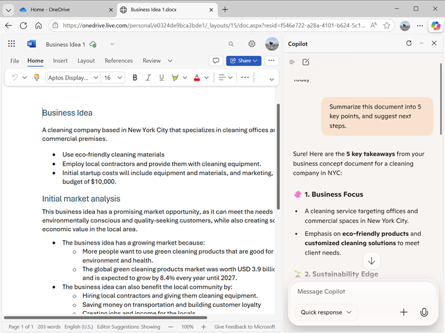

---
lab:
  title: "Explorar Copilot en Microsoft\_Edge"
---
# Explorar Microsoft Copilot en Microsoft Edge

¡Te damos la bienvenida al emocionante mundo de Microsoft Copilot!

En este ejercicio, aprovecharás el poder de Copilot para explorar una nueva idea empresarial: crear una empresa de limpieza para empresas.

Imagina esto: estás a punto de empezar un servicio de limpieza de primera categoría que revolucionará los espacios de oficina de todas partes. Con Microsoft Copilot de tu lado, investigarás las tendencias del mercado y desarrollarás un sólido plan de negocio. Pero eso no es todo. También crearás documentos atractivos, presentaciones entretenidas y correos electrónicos convincentes para ayudar a mostrar tu idea y atraer a los inversores.

Prepárate para dar rienda suelta a tu creatividad y agudeza empresarial a medida que te adentras en este atractivo e interactivo laboratorio. Al final de este ejercicio, dispondrás de un completo conjunto de materiales que te encaminarán hacia el éxito empresarial. Empecemos y hagamos realidad tu empresa de limpieza para empresas.

Este ejercicio debería tardar en completarse **40** minutos aproximadamente.

> **Nota**: En este ejercicio, se supone que tiene una [cuenta de Microsoft personal](https://signup.live.com) (por ejemplo, una cuenta de outlook.com) con la que ha iniciado sesión en [Microsoft Edge](https://www.microsoft.com/edge/download) en el equipo. Si tienes una cuenta profesional y otra personal, asegúrate de seleccionar tu cuenta *personal* en la configuración de la cuenta, en la parte superior izquierda de Microsoft Edge.

## Uso de Copilot para explorar un documento e investigar una idea

Para iniciar la exploración de la IA generativa, vamos a usar Microsoft Copilot en Edge para examinar un documento existente y extraer información de ella.

1. En Microsoft Edge, vaya a [OneDrive](https://onedrive.live.com) en `https://onedrive.live.com` e inicie sesión con su cuenta de Microsoft personal. Una vez ahí, cierre los mensajes de bienvenida o las ofertas que se muestran.
1. En otra pestaña del explorador, abra el documento [Business Idea.docx](https://github.com/MicrosoftLearning/mslearn-copilot/raw/main/Allfiles/Business%20Idea.docx) desde `https://github.com/MicrosoftLearning/mslearn-copilot/raw/main/Allfiles/Business%20Idea.docx`. Después, cuando el documento se abra en Edge, selecciona la opción **Editar una copia** para copiar el documento en tu OneDrive. A continuación, el documento debe abrirse automáticamente en Microsoft Word Online.

    > **Sugerencia**: si no ves la opción de editar una copia, descárgala en tu equipo local. Después, en OneDrive, usa el botón **+ Agregar nuevo** para cargar el archivo **Business Idea.docx** desde tu equipo local a OneDrive.

1. Consulta el texto del documento **Business Idea.docx**, en el que se describen algunas ideas de alto nivel para un negocio de limpieza en la ciudad de Nueva York.
1. Use el icono de **Copilot** en la barra de herramientas de Edge para abrir el panel Copilot, como se muestra aquí:

    

1. En el cuadro de chat de la parte inferior del panel Copilot, escriba la siguiente indicación:

    ```prompt
    Summarize this document into 5 key points, and suggest next steps.
    ```

    Si se le solicita, confirme que desea permitir que Copilot acceda a la página.

1. Revisa la respuesta de Copilot, que debería resumir los puntos principales del documento y sugerirte algunas acciones de seguimiento, como se muestra aquí:

    

    > **Nota**: La respuesta específica puede variar.

    Esperamos que Copilot haya proporcionado algunas instrucciones útiles. Sin embargo, si tienes preguntas adicionales, puedes solicitar información más específica.

1. Escriba lo siguiente:

    ```prompt
    How do I go about setting up a business in New York?
    ```

1. Revisa la respuesta, que debería contener algunos consejos y vínculos a recursos que te ayuden a empezar a crear una empresa en Nueva York.

    > **Importante**: La respuesta generada por IA se basa en la información pública en la Web. Aunque puede ser útil ayudarle a comprender los pasos necesarios para establecer un negocio, no se garantiza que sea 100 % preciso. No reemplace la necesidad de asesoramiento profesional.

## Uso de Copilot para crear contenido para un plan de negocio

Ahora que ha realizado algunas investigaciones iniciales, vamos a que Copilot le ayude a desarrollar un plan de negocio para su empresa de limpieza.

1. Con el documento **Business Idea.docx** abierto en Microsoft Edge, en el panel Copilot, escriba la siguiente indicación:

    ```prompt
    Suggest a name for my cleaning business.
    ```

1. Revisa las sugerencias y selecciona un nombre para tu empresa de limpieza (o continúa solicitando más sugerencias hasta encontrar un nombre que te guste). Cuando hayas elegido uno, indica a Copilot cuál es; por ejemplo, escribe `Let's go with the first one.`.
1. Asegúrate de que el documento **Idea de negocio** sigue abierto en la página principal del explorador y después escribe la siguiente consulta:

    ```prompt
    Based on the contents of this document, create a business plan for my cleaning business.
    ```

1. Revise la respuesta. Después, en el panel de Microsoft Word, en el menú **Archivo**, crea un nuevo documento en blanco. Cierra el panel **Diseñador** si se abre y cambia el nombre del nuevo documento de *Documento* a `Business Plan`.
1. Copia el plan de negocio que se ha generado en el panel Copilot y pégalo en el documento del plan de negocio:

    

1. En el panel Copilot, escriba la indicación siguiente:

    ```prompt
    Create a corporate logo for the cleaning company. The logo should be round and include an iconic New York landmark.
    ```

1. Revisa la imagen generada por Copilot.

1. Usa más indicaciones para iterar en el diseño (por ejemplo, `Make it green and blue`) hasta que tengas un logotipo que te guste.

    > **Sugerencia**: cuando Copilot genera imágenes que contienen texto, es posible que observes algunos errores ortográficos. Prueba con distintos mensajes hasta que te satisfagan los resultados.

1. Haz clic con el botón derecho en el logotipo generado y cópialo en el Portapapeles. Después, péguelo en la parte superior del documento del plan de negocio, de la siguiente manera:

    

1. Cierra las pestañas del explorador de Microsoft Word y vuelve a OneDrive.

## Uso de Copilot para generar y visualizar proyecciones financieras

Con la ayuda de Copilot, ha creado un borrador de un plan de negocio para la idea de un negocio de limpieza. Ahora vamos a usar Copilot para realizar algunos cálculos que ayudarán a refinar aún más el plan de negocio.

1. En OneDrive, usa el botón **(+)** para agregar un nuevo **Libro de Excel**. Después cambia el nombre del libro por `Financial Projections`.
1. En el panel Copilot, escriba la indicación siguiente:

    ```prompt
    Create a table of projected profits for the next 5 years, starting with this year. The profit this year should be $10,000 and it should increase by 12% each year.
    ```

1. Revisa la respuesta, que debe incluir una tabla de beneficios proyectados durante los próximos cinco años.
1. Copia la tabla en el Portapapeles (teniendo cuidado de seleccionar solo la tabla). Después selecciona la celda A1 en el libro de Excel, y en la pestaña **Inicio**, en el menú **Portapapeles**, en **Pegar especial**, selecciona **Valores solo** para que los valores de la tabla se peguen en la hoja de cálculo de la siguiente manera:

    

1. En el panel Copilot, escriba la indicación siguiente:

    ```prompt
    What's a good way to visualize these projections in a chart?
    ```

1. Revisa la respuesta, que debe recomendar algunas maneras de visualizar los datos de proyecciones. Después, escribe la siguiente solicitud:

    ```prompt
    How do I create a line chart in Excel?
    ```

1. Sigue las instrucciones de Copilot para crear un gráfico de líneas.

    > **Sugerencia**: puede que tengas que ajustar el eje de datos predeterminado seleccionado por Excel. Selecciona el gráfico de la hoja de cálculo y, en la pestaña **Gráfico**, selecciona **Seleccionar datos**. Después, en el panel **Gráfico**, en la pestaña **Datos**, modifica la configuración para que el campo **Año** sea la etiqueta horizontal y solo se use el campo **Beneficio proyectado** como valor de línea:

    

1. Cierra la pestaña **Gráfico** para ver el gráfico en la hoja de cálculo.

1. Cierra la pestaña del explorador de Microsoft Excel y vuelve a OneDrive.

## Uso de Copilot para crear contenido para una presentación

Gracias a Copilot, has creado un plan de negocio para la empresa de limpieza y has generado algunas proyecciones financieras. Ahora necesitará una presentación eficaz para convencer a un inversor de prestarle la financiación para iniciar el negocio.

1. En OneDrive, agrega una nueva **presentación de PowerPoint**. Si el panel**Designer** se abre automáticamente, ciérrelo. Después, cambia el nombre de la presentación de *Presentación* a `Business Presentation`.

1. En la diapositiva de título de la presentación, escriba el nombre de la empresa de limpieza como título y `Investor Opportunity` como subtítulo.
1. Inserte una nueva diapositiva con el diseño de diapositiva **Dos contenidos** (que incluye un título y dos marcadores de posición para el contenido).
1. Cambie el título de la diapositiva a `Benefits of Hiring a Commercial Cleaner`.
1. En el panel Copilot, escriba la indicación siguiente:

    ```prompt
    Write a summary of the benefits of using a corporate cleaning company for your business. The summary should consist of five short bullet points.
    ```

1. Copie la respuesta de Copilot al Portapapeles y péguela en el marcador de posición de contenido izquierdo. Después, edita y cambia el formato del texto del marcador de posición hasta que te satisfaga.
1. En el panel Copilot, escriba la indicación siguiente:

    ```prompt
    Create a photorealistic image of a clean office.
    ```

1. Cuando Copilot haya generado una imagen que le guste, cópiela en el Portapapeles y péguela en el marcador de posición de contenido de la derecha de la diapositiva.

    Si el panel **Designer** se abre automáticamente, seleccione un diseño de diapositivas que desee. A continuación, cierre el panel **Designer**.

1. Aplica los cambios de formato que creas necesarios hasta que obtengas una diapositiva que te satisfaga:

    

1. Abre una nueva pestaña del explorador y úsala para descargar la imagen [mopping.png](https://github.com/MicrosoftLearning/mslearn-copilot/raw/main/Allfiles/mopping.png) de `https://github.com/MicrosoftLearning/mslearn-copilot/raw/main/Allfiles/mopping.png` a tu equipo local y guárdala en cualquier carpeta.
1. Vuelve a la pestaña del explorador que contiene tu presentación de PowerPoint y, en el panel de Copilot, usa el botón **+** situado junto al cuadro de chat para cargar la imagen **mopping.png** en Copilot y agrega la solicitud `What does this image show?`.
1. Revisa la respuesta, que debe ser similar a esta:

    

1. Realiza un seguimiento con la siguiente solicitud y revisa la respuesta:

    ```prompt
    Would this image be helpful to promote a commercial cleaning business?
    ```

    Copilot ha analizado la imagen y ha evaluado su utilidad para tu escenario empresarial específico de la misma manera que pedirías la opinión de un colega.

1. En PowerPoint, agrega una nueva diapositiva con el mismo diseño de **Dos contenidos** que antes. Después, en uno de los marcadores de posición de contenido, carga la imagen **mopping.png** para agregarla a la diapositiva.

1. En el panel Copilot, escriba la indicación siguiente:

    ```prompt
    Write a short paragraph to accompany this image, emphasizing the professionalism of the cleaning staff we employ.
    ```

1. Revisa el texto resultante y cópialo en el marcador de posición de contenido vacío de la diapositiva, edítalo y dale el formato que consideres necesario.
1. En el panel Copilot, escriba la indicación siguiente:

    ```prompt
    Suggest a good title for a slide that contains the image and text.
    ```

1. Usa el título sugerido para la diapositiva, y después usa el Diseñador en PowerPoint para dar formato a la diapositiva. Deberías terminar con una diapositiva similar a esta:

    

1. Cierra la pestaña del explorador de PowerPoint y vuelve a tu OneDrive.

## Uso de Copilot para organizar una reunión de financiación

Ha creado algunas garantías para ayudarle a empezar a trabajar con su negocio. Ahora es el momento de comunicarse con un inversor que busque financiar alguna startup.

1. Usa el **Iniciador de aplicaciones** (&#8759;) en el extremo izquierdo de la barra de título de OneDrive para abrir **Outlook**.
1. Cambia a la página **Calendario** y cambia la vista a **Semana laboral**. Si aún no tienes eventos programados en el calendario, puedes agregar un par para que Copilot tenga información con la que trabajar.
1. En el panel Copilot, escriba la indicación siguiente:

    ```prompt
    What events do I have scheduled in this calendar?
    ```
    
    Copilot debe poder leer el calendario en la página web e identificar eventos en el calendario:

    

1. Prueba a usar este aviso para comprobar tu disponibilidad para una reunión con un administrador bancario en busca de financiación para la empresa:

    ```prompt
    What's my availability for a meeting this week?
    ```

    Copilot debe proporcionar un resumen de la disponibilidad en función de la información del calendario de la página web de Outlook.

    > **Nota**: Microsoft Copilot puede leer la página del calendario que está abierta en el explorador (y puede "recordar" detalles durante la sesión actual), pero no puede acceder directamente a los datos del calendario. En un entorno corporativo, tu organización puede usar Microsoft 365 Copilot, que *tiene* acceso a tu calendario y correo electrónico de Outlook, así como a la información de otras aplicaciones empresariales como Microsoft Teams.

1. Cambia a la página **Correo**, y crea un nuevo correo electrónico. Rellena el cuadro **Para** con tu propia dirección de correo electrónico y establece el **Asunto** en `Business funding meeting request`.
1. En el panel Copilot, escriba la indicación siguiente:

    ```prompt
    Write an email to a bank manager requesting a meeting to discuss funding for a commercial cleaning business. The email should be concise and the tone should be professional.
    ```
    
1. Use el contenido generado para completar el correo electrónico, como se muestra aquí:

    

    Puede enviarse el correo electrónico a sí mismo si lo desea.

## Desafío

Ahora ha visto cómo usar Copilot para investigar ideas y generar contenido, ¿por qué no intentar explorar más? Para iniciar una nueva sesión de Copilot, en el menú **+** situado junto al cuadro de chat, selecciona **Iniciar nuevo chat**. Después, basándote en lo que has aprendido en este ejercicio, intenta usar Copilot para planificar una reunión en la que propondrás la adopción de la IA generativa en tu organización. A continuación, se presentan algunas ideas para comenzar:

- Investiga las ventajas de la IA generativa y Microsoft Copilot para las empresas y encuentra información sobre las ventajas de productividad, el ahorro de costes y ejemplos de organizaciones que ya han adoptado la IA correctamente.
- Crea un documento de discusión que se pueda circular como lectura previa antes de la reunión.
- Crea una presentación que puedas usar para exponer tu propuesta, incluyendo datos y visualizaciones para resaltar los elementos clave de tu discurso.
- Redacta un correo electrónico para informar a tus compañeros de trabajo sobre la reunión y contextualizarla.

Use su imaginación como guste y explore cómo Copilot puede ayudarle a encontrar información, generar y refinar texto, crear imágenes y responder preguntas.

## Conclusión

En este ejercicio, ha usado Copilot en Microsoft Edge para buscar información y generar contenido. Esperamos que haya visto cómo usar la IA generativa en un copiloto puede ayudar con la productividad y la creatividad.

Aunque los servicios gratuitos usados en estos ejercicios son sin duda muy eficaces, puedes lograr aún más con servicios como [Microsoft 365 Copilot](https://www.microsoft.com/microsoft-365/enterprise/copilot-for-microsoft-365), en el que Microsoft Copilot se integra en las aplicaciones de productividad de Windows y Microsoft Office y proporciona ayuda muy contextualizada con tareas comunes. Microsoft 365 le permite aportar la eficacia de la IA generativa a los datos y procesos empresariales, al tiempo que se integra en la infraestructura de TI existente para garantizar una solución fácil de administrar y proteger.